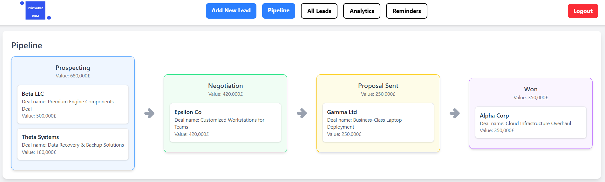

# PrimeBizCRM - Customer Relationship Management (CRM) System

PrimeBizCRM is a Customer Relationship Management (CRM) system designed to help businesses manage leads, pipelines, reminders and invoices. With this CRM, users can efficiently track and manage customer interactions, automate workflows, and create detailed reports. The system is built using **React** for the frontend and **Django** for the backend, providing a robust, scalable solution for managing customer relationships.

---

## Technology Stack

PrimeBizCRM is built using the following technologies:

### **Frontend: React**
- **React** provides a dynamic and interactive user interface, ensuring a seamless and responsive user experience. With React’s component-based architecture, the frontend is modular and easy to extend.

### **Backend: Django**
- **Django** serves as the backend framework, offering a secure, scalable, and maintainable solution for handling business logic and database operations.

### **Database: MySQL**
- The system uses **MySQL** as the relational database for storing leads, customer data, invoices, and reminders. MySQL’s scalability and reliability make it an ideal choice for handling large amounts of business data.

---

## Installation and Setup

### Prerequisites

> **Please note!** ⚠️  
> Currently the project works and has been tested only on Windows!

To run the project, you need to have the following tools installed:

1. **Python** (minimum version 3.12)
   - Download from: [https://www.python.org/downloads/](https://www.python.org/downloads/)

2. **Node.js and npm** (minimum version 10.8)
   - Download from: [https://nodejs.org/](https://nodejs.org/)

3. **MySQL** 
   - Download from: [https://dev.mysql.com/downloads/installer/](https://dev.mysql.com/downloads/installer/)

Link to help installation: https://www.youtube.com/watch?v=u96rVINbAUI

> **Please note!** ⚠️  
> The project build script will ask you for the password you provided during installation and configuration MySQL (Server and Workbench)!

---

### Installation Steps

#### 1. Clone the repository

Clone the PrimeBizCRM repository to your local machine and go to the primebizcrm directory:

```bash
git clone https://github.com/yourusername/PrimeBizCRM.git
cd PrimeBizCRM
```

#### 2. Run the Setup Script
The setup_project.bat script will automatically set up the frontend, backend, and database for you.

```bash
setup_project.bat
```

This script will do the following:
- Install npm packages for the frontend
- Create and activate a Python virtual environment (venv)
- Install required Python packages
- Set up the MySQL database and run migrations

#### 3. Run the Project
Once the setup is complete, run the start_project.bat script to start both the backend and frontend in separate terminals.

```bash
start_project.bat
```

This script will do the following:
- Open two separate terminal windows
- Start the Django backend
- Start the React frontend

You can use sample data to log in to the service:
```Python
users_data = [
    {"username": "BusinessStrategist", "password": "bs123!"},
    {"username": "ClientRelationsPro", "password": "crp123!"},
    {"username": "RevenueLeader", "password": "rl123!"},
]
```

---

## Screenshots
Here are some screenshots showcasing the PrimeBizCRM interface:
#### 1. Main Page


#### 2. Pipelines Page


#### 3. Analytics Page


#### 4. Reminders Page

